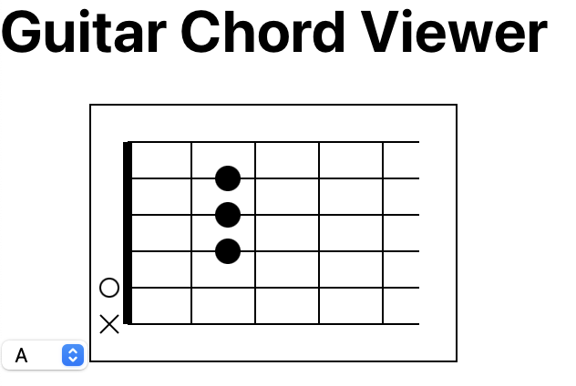

# Guitar-Chord-App
chordData를 통해 기타 코드에 대한 데이터를 저장하면,
운지법 이미지를 노출시켜준다.

## chordData.js
예시) A코드를 나타내는 데이터   
"A": {   
      positions: [ // 줄과 플랫의 위치   
        { string: 4, fret: 2 },   
        { string: 3, fret: 2 },   
        { string: 2, fret: 2 },   
      ],   
      openStrings: [5], // 개방현인 줄   
      mutedStrings: [6], // 뮤트해야하는 줄   
    },

# 결과 미리보기

